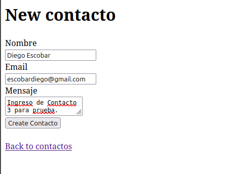
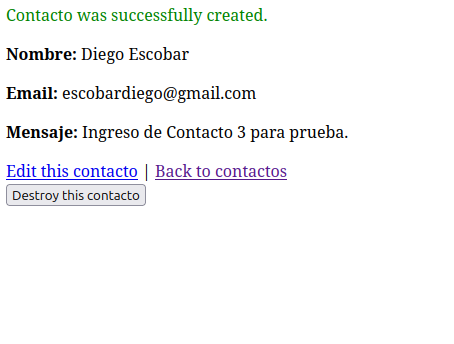
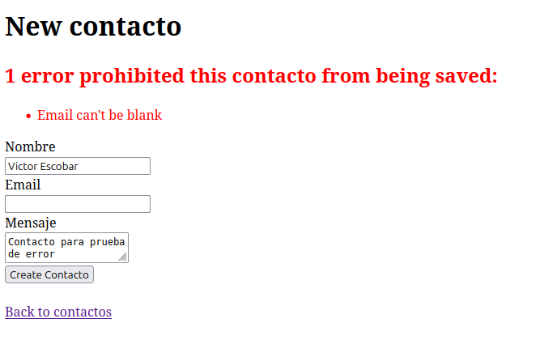

# Tarea 5 Semana 7
## Jeferson Josue Escobar Herrera

> Programacion Web

## Fomulario Funcionando al 100%


## Formulario Registrando al 100%


## Formulario Dando Error al 100%


### Validaciones Aplicadas y Aprendizaje

Algunas validaciones aplicadas en el presente proyecto de ejercicio fueron:

* Restricciones para que ciertos campos en especificos no esten vacios.

* Validacion del campo nombre donde estrictamente tiene que tener 3 caracteres como minimo.

* Evitar duplicidad donde en la tabla del campo email, el email que sea ingresado sea unico.

En lo aprendido del siguiente ejercicio puedo decir que fue la sintaxis y mas sobre el modelo de MVC es algo que la verdad al programador se le facilatan las tareas al programar.

Ademas se aprende a como gestionar los errores posibles en un formulario ya que el ser humano le encantan romper cosas (como yo).

```ruby
puts "Fin"
```